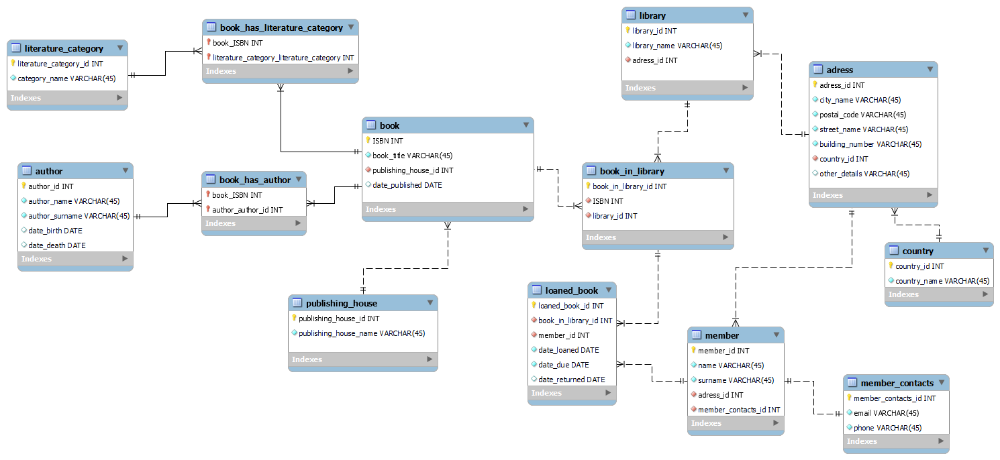

# 1. projekt do předmětu BPC-BDS
Tento repozitář slouží k odevzdání náležitostí k projektu z předmětu BPC-BDS.
Obsahuje složku postgre, kde je skript k vytvoření databáze a soubor s inserty
sloužícími k naplnění databáze daty. Ve složce MySQL je skript v jazyce MySQL
vygenerován automaticky nástrojem MySQL Workbech. Repozitář také obsahuje 
obrázek E-R diagramu návrhu databáze. 
## E-R diagram

